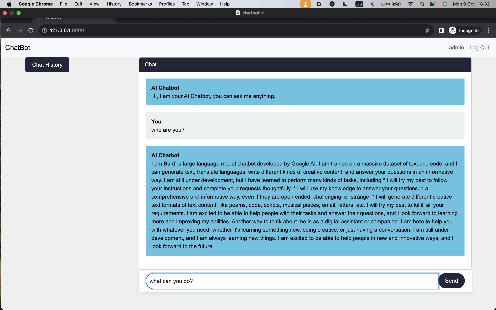

# CS50W - Final Project: MyChatBot

### [VIDEO DEMO](https://youtu.be/eh1A4Ygghq0)

This project is a chatbot implementation that allows users to interact with an AI chatbot powered by the Bard API. Users can send messages to the chatbot, and it will respond with answers generated by the Bard API. This README.md file provides comprehensive documentation of the project, its features, and the rationale behind its design and implementation.

## Table of Contents

- [Skills](#Skills)
- [Screenshots](#Screenshots)
- [Project Overview](#project-overview)
- [Features](#features)
- [Project Structure](#project-structure)
- [Distinctiveness](#Distinctiveness)
- [Complexity](#Complexity)
- [Getting Started](#getting-started)
- [Dependencies](#dependencies)
- [Usage](#usage)
- [Contributing](#contributing)


## Skills

The development of MyChatBot encompasses a wide range of skills, including:

- **Javascript**: Utilized for real-time updates and dynamic interactions in the chat interface.
- **Fetch Calls**: Used to communicate with external APIs like the Bard API for generating chatbot responses.
- **API Integration**: MyChatBot leverages the Bard API to provide users with meaningful responses.
- **Django**: The backbone of the application, handling user authentication, session management, and database operations.
- **Python**: Used for back-end development and managing server-side logic.
- **DOM Manipulation**: Enables dynamic updates in the user interface.
- **HTML & CSS**: Creating the structure and styling for the web application.
- And more...


## Screenshots


## Project Overview

The Chatbot Project is a Django-based web application that leverages the Bard API to provide AI-powered chatbot capabilities. It allows users to have conversations with the chatbot by sending text messages and receiving responses. Users can also view the chat history and interact with previous conversations.

## Features

1. **User Authentication**: Users can register, log in, and log out to access the chatbot.
2. **Chat History**: Users can view their chat history, including both their messages and the chatbot's responses.
3. **Real-time Chat**: Messages sent by users and responses from the chatbot are displayed in real-time.
4. **Responsive Design**: The web application is designed to be responsive and user-friendly on both desktop and mobile devices.
5. **User-Friendly Interface**: The user interface is intuitive and easy to use, with a chat input box and chat history panel.

## Project Structure

The project is structured as follows:

- `chatbot/`: The main Django application folder containing views, templates, and models.
- `README.md`: This documentation file.
- `requirements.txt`: Lists the project's Python dependencies.
- `templates/`: HTML templates for the web interface.
- `static/`: Static files (CSS, JavaScript, etc.) for the web application.

## Distinctiveness and Complexity

### Distinctiveness
The Chatbot Project distinguishes itself from other projects in this course through the following distinct features:

- It implements a real-time AI chatbot that interacts with users, providing responses based on the Bard API.
- Unlike other projects, which focus on common web application types, this project offers a unique conversational experience.
- The project's primary focus is on user interaction and natural language processing, making it distinct from other projects.

### Complexity
The complexity of the Chatbot Project is evident in the following aspects:

- Utilizes Django on the back-end, including models for users, chat sessions, and messages, establishing complex relationships.
- Implements a real-time chat interface using JavaScript on the front-end, allowing users to have interactive conversations with the chatbot.
- Adopts a mobile-responsive design to ensure usability on various devices.
- Implements user authentication and authorization for chatbot access and chat history management.
- Integrates external API (Bard API) for generating chatbot responses, enhancing the project's complexity.


## Getting Started

To run this project locally, follow these steps:

1-Clone the repository:
```bash
git clone https://github.com/your-username/chatbot-project.git
cd chatbot-project
```
2-Install the project dependencies using pip:
```bash
pip install -r requirements.txt
```
3-Set up environment variables:
- Create a .env file in the project directory.
- Add your Bard API key to the .env file:
```bash
BARD_API_KEY=your_api_key_here
```
4-Run the Django development server:
```bash
python manage.py runserver
```
5-Access the chatbot web application in your web browser at http://localhost:8000.

## Dependencies

The project relies on the following Python packages and libraries:

- **Django**: A Python web framework for building web applications.
- **Bard API**: An external API for generating responses to user messages.
- **Python dotenv**: For loading environment variables from a `.env` file.
- **requests**: For making HTTP requests to the Bard API.

## Usage

1. Register a new user account or log in with an existing account.
2. Type your message in the chat input box and press "Send" to send a message to the chatbot.
3. The chatbot will respond with an answer generated by the Bard API.
4. You can view your chat history by clicking the "Chat History" button.

## Contributing

Contributions to this project are welcome! If you have ideas for improvements or new features, please open an issue or submit a pull request.


